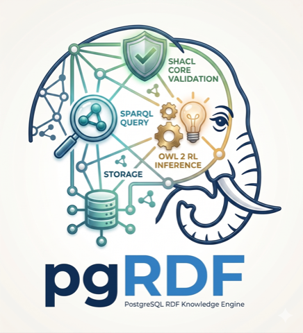

# pgRDF

[](LICENSE)
[](https://www.postgresql.org/)
[](https://github.com/styk-tv/pgRDF/actions/workflows/ci.yml)
[](./LATEST.md)
[](docs/05-validation.md)
[](docs/04-inference.md)
[](#scale)
[](#scale)

**A Rust-native PostgreSQL extension for RDF, SPARQL, SHACL and OWL reasoning — the whole semantic stack in one database.**

## One instance instead of a farm

The usual answer to "we need a knowledge graph next to our models" is a
farm: a triple store over here, a SHACL validator service over there, a
reasoner batch job, an export pipeline between them, and glue code that
turns every question into a distributed-systems question. Each box has
its own lifecycle, its own failure modes, and its own copy of the data.

pgRDF is the other answer. One PostgreSQL extension gives you
dictionary-encoded quad storage, a SPARQL 1.1 query **and** update
engine, a W3C-conformant SHACL Core validator, an OWL 2 RL + RDFS
reasoner, and canonical graph identity — **in the same database that
already holds the rest of your state**. Load RDF, then reason over it,
validate it, prove what it is, and query it in place, from any client
that speaks Postgres. No sidecar store. No ETL. No second system to
operate, back up, or explain to on-call.

Scale is the ceiling, not the price of entry: a complete
8.2-billion-triple Wikidata `truthy` dump has been ingested into one
instance, and the full load → reason → query pipeline has been run end
to end at LUBM-500. The typical deployment is a right-sized graph in a
single container.

## Capabilities

Everything below is a SQL function call inside your database.

### Query & update — SPARQL 1.1

| Surface | What ships |
|---|---|
| `pgrdf.sparql(query)` | SELECT / ASK / CONSTRUCT / DESCRIBE / UPDATE through one entry point, lowered to SQL joins on a pinned, cross-product-proof plan |
| Patterns | multi-triple `OPTIONAL`, `UNION`, `MINUS`, `VALUES`, `BIND`, named graphs (`GRAPH <iri>` and `GRAPH ?g`) composed across all of them |
| Filters | boolean composition, term-type tests, `REGEX`, numeric & typed comparison |
| Aggregates | `COUNT` / `SUM` / `AVG` / `MIN` / `MAX` / `GROUP_CONCAT` / `SAMPLE` with `GROUP BY` / `HAVING`, including over `UNION` |
| Property paths | `^` `+` `*` `?` `\|`, with a materialised-closure fast path and a depth guard |
| CONSTRUCT / DESCRIBE | graph-producing queries; DESCRIBE follows W3C §16.4 Concise Bounded Description |
| UPDATE | the complete algebra — `INSERT DATA` / `DELETE DATA` / `INSERT WHERE` / `DELETE WHERE` / `DELETE/INSERT WHERE`, graph-scoped |

→ [querying guide](guide/03-querying.md) · [query engine internals](docs/03-query.md)

### Validate — W3C SHACL Core

`pgrdf.validate(data_graph, shapes_graph)` runs a genuinely conformant
SHACL Core validator — **25/25** on the W3C conformance surface —
returning a machine-readable report. Shapes are just another graph in
the same store, so the gate that judges your data lives beside it.

→ [validation](docs/05-validation.md)

### Reason — OWL 2 RL + RDFS

`pgrdf.materialize(graph, profile)` computes the inference closure and
stores it beside the asserted triples, never mixed into them. Inferred
triples are queryable immediately and re-derivable at any time —
derived knowledge stays derived.

→ [inference](docs/04-inference.md)

### Load — from a file to eight billion triples

| Loader | When |
|---|---|
| `parse_turtle` / `parse_trig` / `parse_nquads` | inline content, straight from SQL |
| `load_turtle` | server-side files, with lenient / verbose variants |
| `load_turtle_streaming` | windowed streaming for dumps larger than memory |
| `load_turtle_staged_run` | the multi-backend staged bulk loader — the Wikidata-scale path |

The turtle funnel records the **sha256 of the bytes it loaded**
(`source_sha256` on the graph), so downstream systems can pin exactly
what went in.

→ [loading guide](guide/02-loading-rdf.md) · [storage](docs/02-storage.md)

### Custody — graphs with a lifecycle

| Function | Effect |
|---|---|
| `add_graph` / `drop_graph` / `clear_graph` | create, remove, empty |
| `copy_graph` / `move_graph` | duplicate or rename wholesale |
| `carve_graph` | predicated sub-graph extraction — carve a working set out of a large graph |
| `lock_graph` / `unlock_graph` | write custody: a locked graph refuses mutation until deliberately unlocked |
| `graph_integrity` | structural health check — non-IRI predicates, literal subjects, dangling references |

→ [recipes](docs/11-recipes.md)

### Identity — what a graph *means*, not what it happens to look like

`pgrdf.graph_digest(graph)` computes the **W3C RDFC-1.0 canonical
digest**: blank nodes are canonically relabelled, the graph is
serialised as canonical N-Triples, and the result is hashed. Isomorphic
graphs produce **equal** digests; unequal digests **prove** difference.
Byte digests identify a stored copy; this identifies meaning — the
difference matters the moment a graph is reloaded and every blank-node
label re-mints. Conformance is proven against the W3C rdf-canon suite
byte-for-byte.

### Operations — an engine that tells the truth about itself

| Surface | What it answers |
|---|---|
| `pgrdf.version()` / `pgrdf.build_id()` | what code is running — the build id is stamped by CI from the release tag, so a workstation build self-identifies and can never impersonate a release |
| `pgrdf.stats()` | cache hit rates, plan-cache state, and the fail-closed counters below |
| `pgrdf.shmem_reset()` / `shmem_cache_prewarm()` | cross-backend dictionary-cache control |
| `pgrdf.sparql_parse()` / `sparql_sql()` | see the algebra and the generated SQL for any query |

## Fail-closed, on principle

A query engine that cannot apply a clause has two options: refuse, or
silently return more than you asked for. pgRDF refuses — an
untranslatable filter raises an error naming the construct, it never
silently widens a result set. The `stats()` counters
(`filter_clauses_dropped`, `path_depth_truncations`) exist so that
*silent incompleteness is always detectable*: any future path that
skips a clause instead of refusing must increment them. The same
principle runs through the store — imports can be gated on an expected
digest (a mismatch refuses and writes nothing), locked graphs refuse
writes, and restore-style workflows mint new graphs beside the old
rather than overwriting.

## Quickstart

Every release is a CI-built, SLSA-attested OCI artifact. Pull it, drop
two paths into a stock `postgres:18` image, done:

```sh
oras pull ghcr.io/styk-tv/pgrdf-bundle:0.6.33-pg18-amd64   # or -arm64
# → lib/pgrdf.so                → $(pg_config --pkglibdir)/
# → share/extension/pgrdf*      → $(pg_config --sharedir)/extension/
```

```sql
CREATE EXTENSION pgrdf;

SELECT pgrdf.add_graph('urn:demo');                          -- a named graph
SELECT pgrdf.parse_turtle($$
  @prefix ex: <http://example.org/> .
  ex:alice a ex:Person ; ex:knows ex:bob .
  ex:bob   a ex:Person .
$$, pgrdf.graph_id('urn:demo'));

SELECT pgrdf.sparql('SELECT ?s WHERE { ?s a <http://example.org/Person> }');
SELECT pgrdf.materialize(pgrdf.graph_id('urn:demo'));        -- OWL 2 RL closure
SELECT pgrdf.graph_digest(pgrdf.graph_id('urn:demo'));       -- canonical identity
```

The current advertised release, per-architecture digests, and pull URIs
always live in [LATEST.md](./LATEST.md).

## Provenance

Releases are forward-only — one version is one commit SHA, forever — and
every published artifact carries a verifiable SLSA Build Provenance v1
attestation. Verifying is one command:

```sh
gh attestation verify oci://ghcr.io/styk-tv/pgrdf-bundle:0.6.33 --repo styk-tv/pgRDF
```

A successful verify means: built by this repository's release workflow
from the tagged commit, signed via GitHub's Fulcio CA, recorded in
Sigstore's Rekor transparency log, digest matching what you pulled. The
full policy is [PROVENANCE.md](./PROVENANCE.md).

## Scale

Benchmarks push the limits to learn where they are:

- **Wikidata `truthy`, 8.2 billion triples**, ingested into a single
  instance through the staged bulk loader.
- **LUBM-500**: the full load → reason → query pipeline, ending in a
  112-million-quad materialised closure.

The engine that survives those runs is the same `.so` you pull above.

## Documentation

| | |
|---|---|
| [guide/](guide/) | user-facing: install, loading, querying, validation recipes |
| [docs/](docs/) | engineering: architecture, storage, query engine, inference, validation, testing, releases |
| [specs/](specs/) | authoritative specifications |
| [CHANGELOG.md](./CHANGELOG.md) | release-by-release history |
| [pgrdf.styk.tv](https://pgrdf.styk.tv) | the documentation site |

## License

[MIT](LICENSE) — © Peter Styk.
